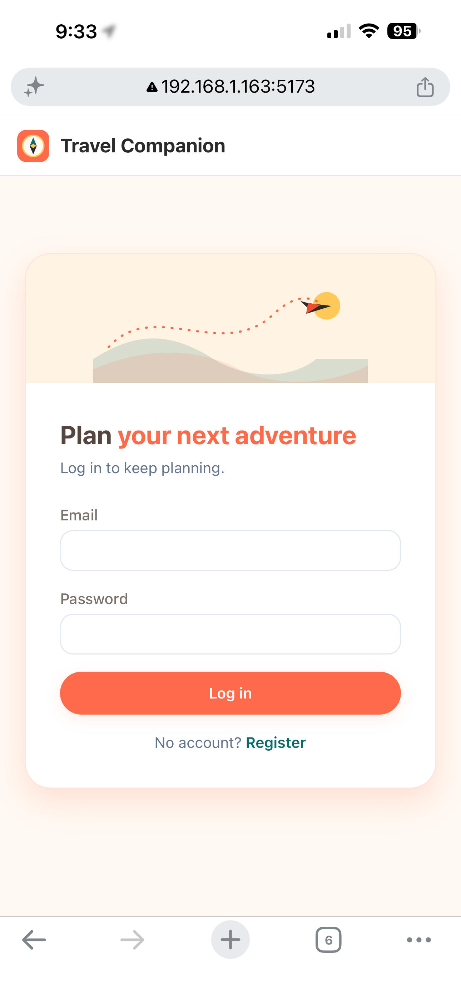
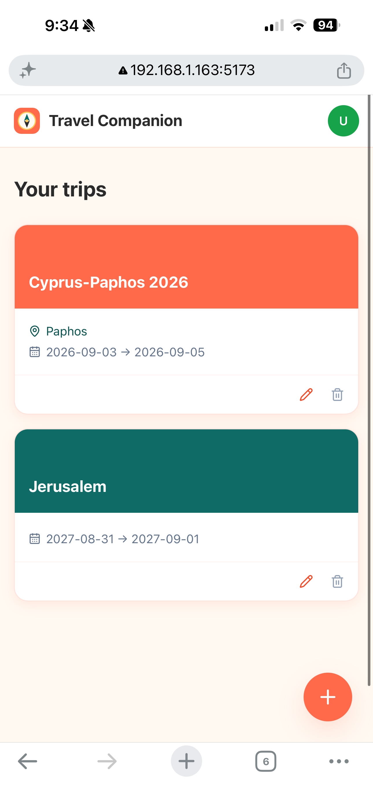
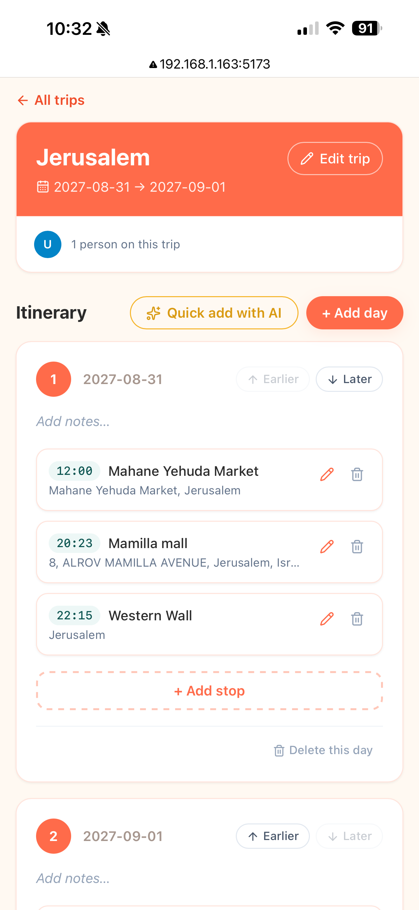
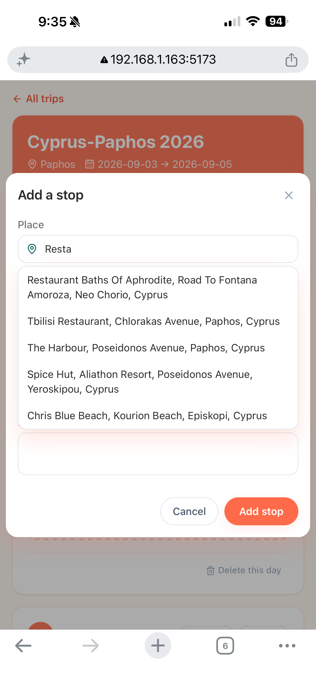

# Travel Companion — Frontend

A React + TypeScript single-page app for the `travel-companion` Kotlin/Spring Boot backend. Register or log in, create trips, build a day-by-day itinerary, add stops resolved against Google Places, share trips with collaborators, reorder days, and turn a free-text description of your plans into itinerary days/stops with AI quick-add — all backed by the existing REST API.


## Screenshots

| Login | Your trips |
|---|---|
|  |  |

| Trip detail & itinerary                                 | Add a stop (place search) |
|---------------------------------------------------------|---|
|  |  |

## 1. Tech stack

1. React 18 + TypeScript, built with Vite.
2. React Router for pages (login, register, trips list, trip detail).
3. Tailwind CSS for styling.
4. No state-management library — a small `fetch` wrapper (`src/api/client.ts`) plus React Context for the auth token. Kept intentionally simple for a demo/interview project.

## 2. Run it locally

1. Start the backend first (from the `travel-companion` repo): `docker compose up --build` — it listens on `http://localhost:8080`.
2. In this folder: `npm install`
3. `npm run dev`
4. Open `http://localhost:5173`, register an account, and start planning.

In dev, Vite proxies `/api/*` to `http://localhost:8080` (see `vite.config.ts`), so the browser only ever talks to `localhost:5173` — no CORS setup needed locally. Point the proxy at a different backend with `VITE_BACKEND_ORIGIN` (copy `.env.example` to `.env.local`).

## 3. Building for production / deploying separately from the backend

1. `npm run build` outputs static files to `dist/` — deploy them anywhere that serves static files (S3+CloudFront, Netlify, Vercel, nginx, etc.).
2. Set `VITE_API_BASE_URL` at build time to the backend's public URL, e.g. `VITE_API_BASE_URL=https://api.example.com npm run build`.
3. Because the frontend and backend are then on different origins, **the backend needs CORS enabled** — right now `SecurityConfig.kt` doesn't configure it. Add something like this before deploying the frontend separately:

   ```kotlin
   @Bean
   fun corsConfigurationSource(): CorsConfigurationSource {
       val config = CorsConfiguration().apply {
           allowedOrigins = listOf("https://your-frontend-domain.com")
           allowedMethods = listOf("GET", "POST", "PUT", "DELETE", "OPTIONS")
           allowedHeaders = listOf("Authorization", "Content-Type")
       }
       return UrlBasedCorsConfigurationSource().apply { registerCorsConfiguration("/**", config) }
   }
   ```

   ...and call `.cors { }` in the `filterChain`'s `HttpSecurity` builder, alongside the existing `.csrf { it.disable() }`.

## 4. What's implemented

1. **Auth** — register/login against `/api/auth/*`, JWT stored in `localStorage`, attached as `Authorization: Bearer` on every request. The JWT's `email` claim is decoded client-side just to show who's logged in.
2. **Trips** — list, create, edit (optimistic-locking aware: sends `version`, surfaces the backend's `409 VERSION_CONFLICT` as a friendly error), delete. Destination picked via the Google Places autocomplete endpoint.
3. **Itinerary days** — add, delete, reorder (swap with a neighbor), inline-editable notes.
4. **Stops** — add/edit/delete within a day, with the same place-autocomplete component (biased to the trip's destination), start/end time, notes. Title is optional when a place is picked (the backend falls back to the place's name).
5. **Collaborators** — list owner + editors, owner can invite by email or remove an editor. Non-owners see a read-only list.
6. **Errors** — the backend's RFC 7807 `application/problem+json` responses are parsed and shown inline, including per-field validation errors.
7. **AI quick-add** — describe your plans in plain text ("land at 3pm, dinner at 7 in the old city") and it's turned into itinerary days/stops automatically: `POST /api/trips/{id}/quick-add` calls the backend's `ai-service` to extract structure, resolves each stop against Google Places, and persists everything to the trip in one request. Owners and editors can use it; results are added directly (no separate confirm step), and the UI just re-syncs the itinerary afterward.

## 5. Project layout

```
src/
  api/          fetch wrapper + one module per resource (auth, trips, days, stops, places, collaborators, quickAdd)
  components/   shared UI (forms, modals, cards, autocomplete)
  context/      AuthContext (token + decoded user)
  pages/        one component per route
  types/        TypeScript types mirroring the Kotlin DTOs
```
